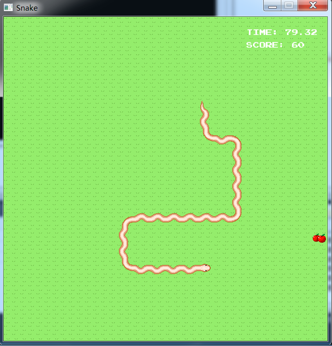
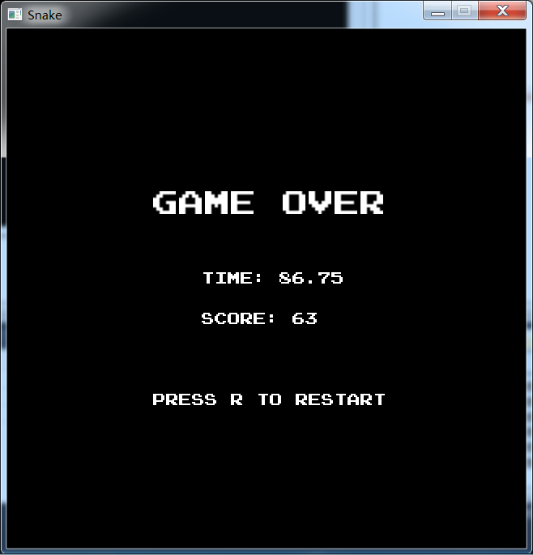

# OpenGL-Snake

This is a classic snake 🐍 game implemented with OpenGL, based on [LearnOpenGL/Breakout](https://learnopengl.com).

## Screenshots

## Development Environment

* Visual Studio 2010

## Artworks Used in This Project

* PressStart2P
* The Essential Retro Video Game Sound Effects Collection
* [Shaanti](http://freemusicarchive.org/music/Rolemusic/~/Shaanti)
* Snake Artworks (provided by this repo, public domain)

## Libraries Used in This Project

* [GLFW](https://glfw.org)
* [GLAD](https://github.com/Dav1dde/glad)
* [OpenGL Mathematics](https://glm.g-truc.net/0.9.9/index.html)
* [stb](https://github.com/nothings/stb)
* [FreeType](https://freetype.org)
* [irrKlang](https://www.ambiera.com/irrKlang)

Put the header files `*.h` in the `OpenGLFinalProject/include/` folder, the library files `*.lib` in the `OpenGLFinalProject/lib` folder and keep the DLLs `*.dll` under the `OpenGLFinalProject/` folder.

Keep the `glad.c` and `stb_image.cpp` under the `OpenGLFinalProject/` folder as well.

